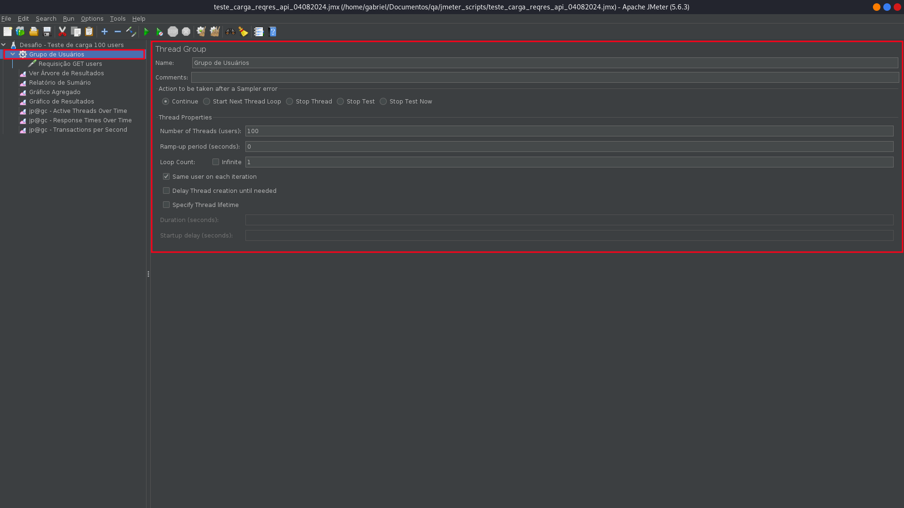
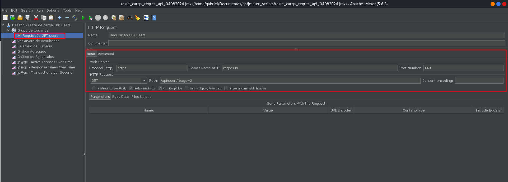
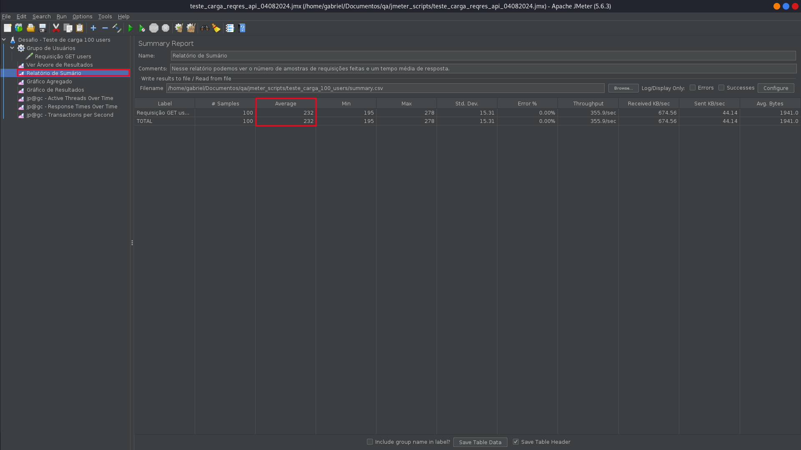
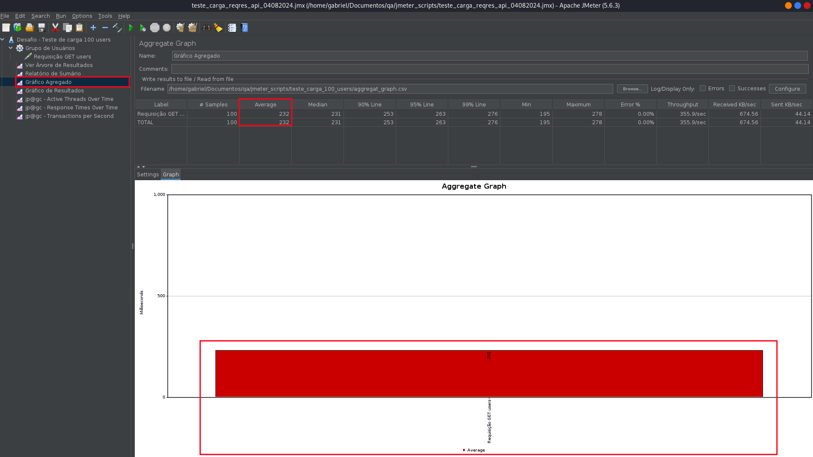
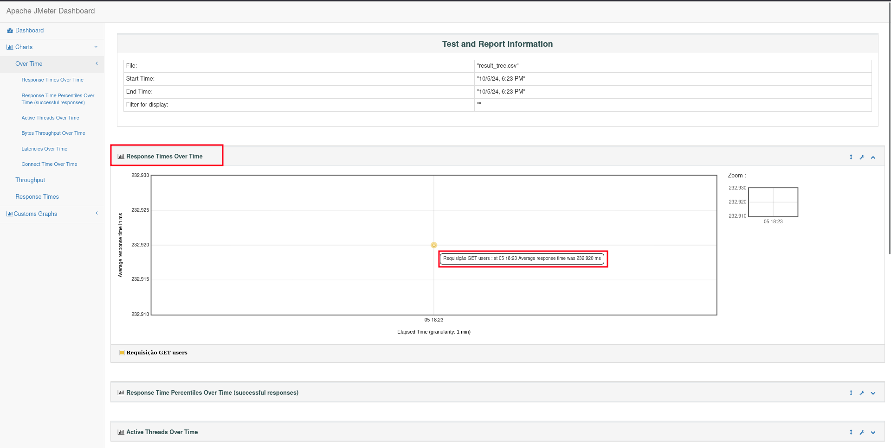
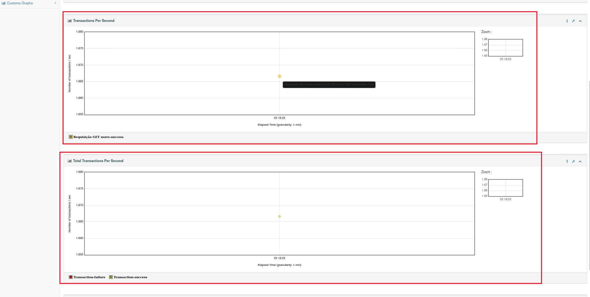
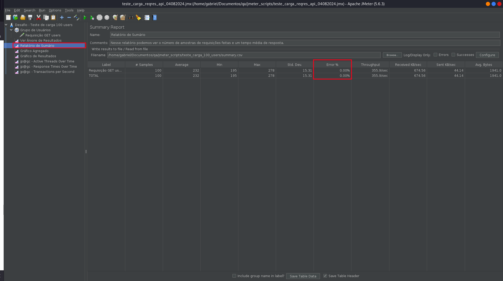
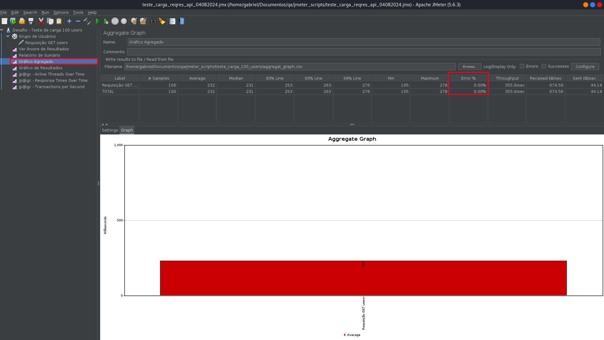
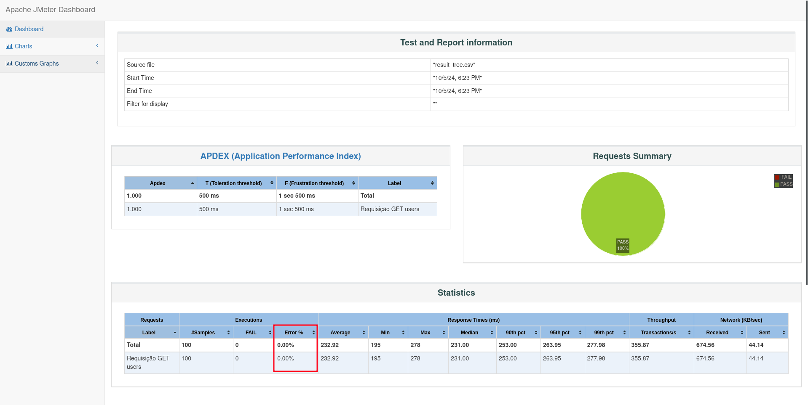

# Teste de Carga 🏋️‍♂️

O plano de teste está disponível no arquivo `teste_carga_regres_api_04082024.jmx`. Os dados da execução estão salvos no diretório `data` e o relatório completo está disponível no diretório `relatorio`. Para visualizar o relatório, basta abrir o arquivo `index.html` em um navegador!

## Configurações ⚙️

### Configuração do Plano de Teste

- **Usuários Simultâneos**: 100

- **Endpoint Testado**: `GET /api/users?page=2`

- **Duração do Teste**: Aproximadamente 1 minuto.

O JMeter foi configurado para simular 100 usuários simultâneos fazendo requisições ao endpoint `GET /api/users?page=2`, abaixo está descrito como isso foi feito:

1. **Dentro do plano de testes, foi criado um Thread Group (Grupo de usuários) com as seguintes configurações**:

   - Número de Threads (Users): 100

   - Ramp-up Period: 0 segundos (todos os usuários começam simultaneamente)

   - Loop Count: 1 (número de vezes que a ação é repetida)
    

    > OBS: A checkbox "Same user on each iteration" se refere ao comportamento dos usuários durante as iterações! Quando marcado, os cookies e cache gerados por um usuário (thread) serão mantidos ao longo das iterações (ocorre persistência de estado). Já se estiver desmarcada, cada iteração é tratada como um usuário diferente (cookies e cache não são reutilizados).
  

2. **Foi adicionado um sampler (testador) ao grupo de usuários**
   - Protocolo: https
   - Nome do servidor: reqgres.in
   - Número da porta: 443 (Padrão HTTPS)
   - Método HTTP: GET
   - Endpoint: /api/users?page=2
    

3. **Análise Gráfica**
   - Para visualizar melhor os resultados e ter uma compreensão mais detalhada dos resultado, foram utilizados os seguintes gráficos:
     - **Árvore de resultados**
     - **Relatório de sumário**
     - **Gráfico agregado**
     - **Gráfico de resultados**
     - **Active Threads Over Time** (plugin)
     - **Response Times Over Time** (plugin)
     - **Transactions Per Second** (plugin)

### Gráficos 📊

Os gráficos gerados durante o teste encontram-se no relatório gerado. Para visualizar o dashboard com o relatório, basta abrir o arquivo `relatorio/index.html`.
> Comando para gerar o relatório com JMeter (Linux): `./jmeter -g local_arquivo/arquivo.csv -o local_diretorio/diretorio_destino`
> 
> OBS: No windows, lembrar de usar "\\" invés de "/".

## Resultados 📈

### Dados Recolhidos (Objetivos)

#### Tempo Médio de Resposta
> OBS: Abra as guias minimizadas para ver imagens dos gráficos!

- **Valor Obtido**: 232.92 ms
  

  
Ver coluna "Average (ms)" nos gráficos Summary Report e Aggregate Report, ou ver gráfico Response Times Over Time.

    
    
    
    

#### Throughput
> É a quantidade de transações que o sistema consegue processar em um determinado período de tempo.

- **Valor Obtido**: Aproximadamente 1.67 transações por segundo.

    

    
Ver gráficos Transactions Per Second e Total Transactions Per Second.

    
    

#### Taxa de Erro

- **Valor Obtido**: 0.00% (todas as requisições foram bem sucedidas).
  

  
Ver coluna "Error %" nos gráficos Summary Report e Aggregate Report, ou em" Statistics" no dashboard do relatório.

    
    
    
    

## Avaliação dos Critérios de Sucesso 🎯

### Critérios Estipulados e avaliação do desempenho

1. **Tempo Médio de Resposta**: Abaixo de 2 segundos para 95% das requisições.
   - Resultado: O valor obtido foi 232.92 ms, que é bem abaixo de 2 segundos.
2. **Taxa de Erro**: Inferior a 1%.
   - Resultado: A taxa de erro foi de 0.00%, cumprindo o critério de ser inferior a 1%.

### Conclusão

Com base nos dados e análises:

- A API cumpriu com sucesso o tempo médio de resposta exigido.
- A taxa de erro encontrada está dentro do limite aceitável.