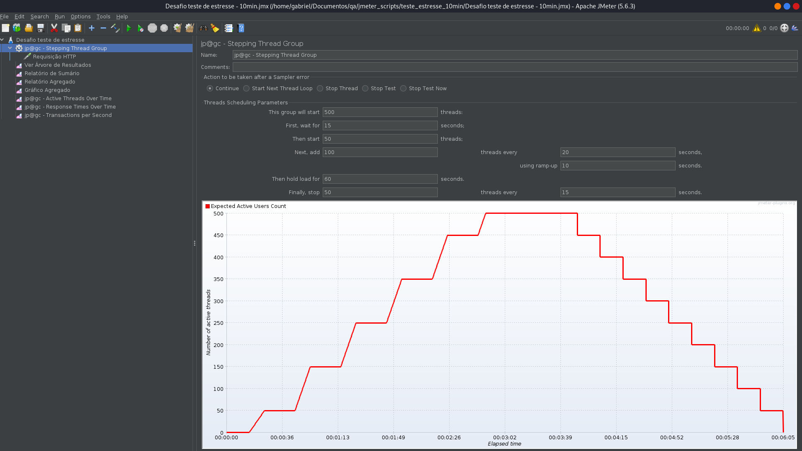
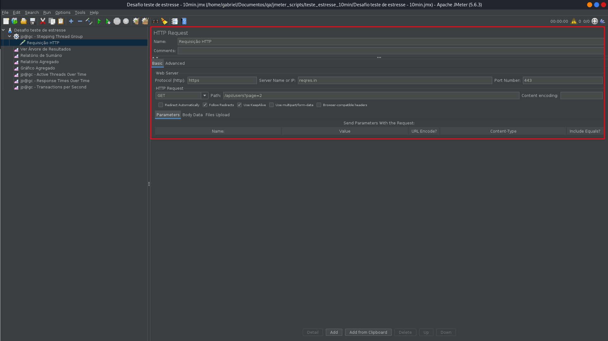
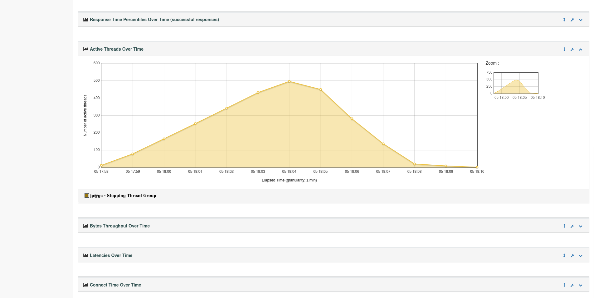
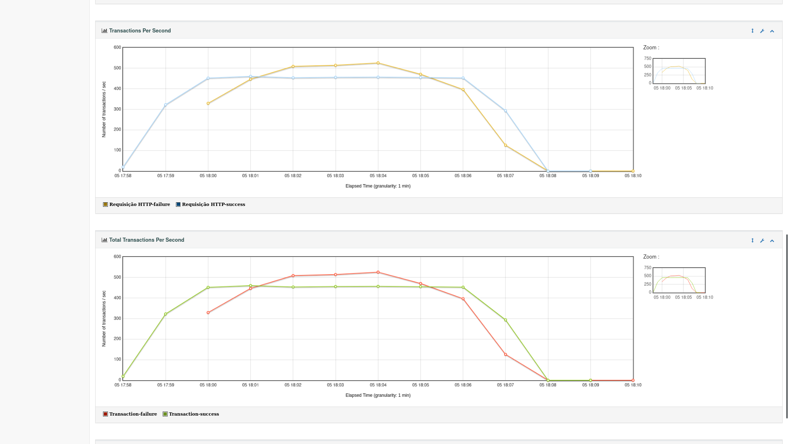
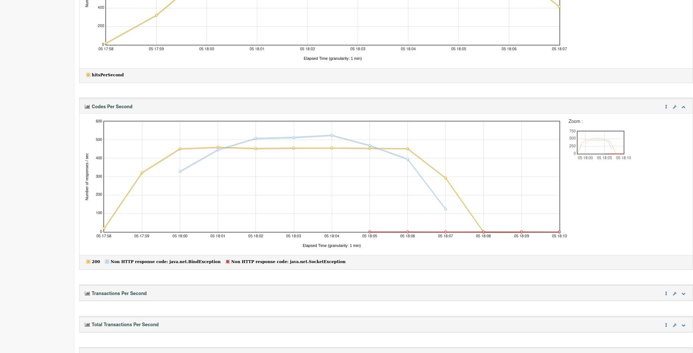
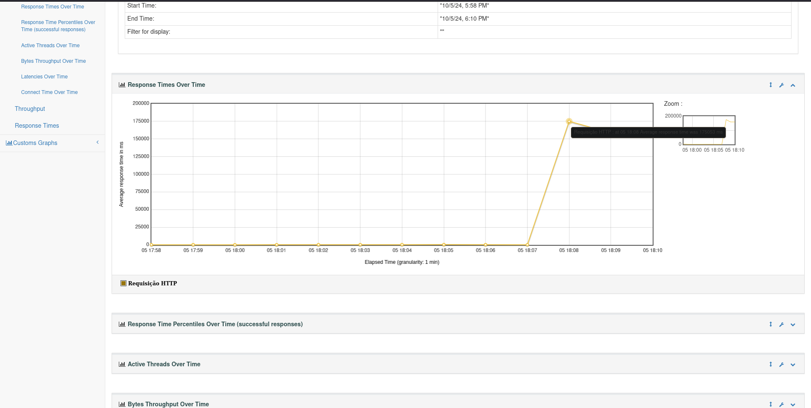
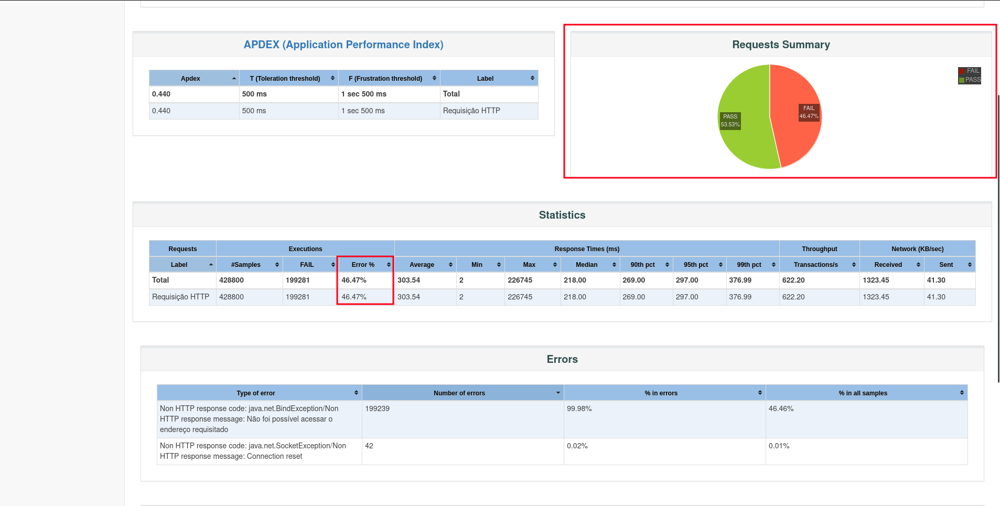

# Teste de Estresse 💪

O plano de teste está disponível no arquivo `Desafio teste de estresse - 10min.jmx`. Os dados da execução estão salvos no diretório `data` e o relatório completo está disponível no diretório `relatorio`. Para visualizar o relatório, basta abrir o arquivo `index.html` em um navegador!

## Configurações ⚙️

### Configuração do Plano de Teste

- **Usuários Inicialmente Simultâneos**: 10 (valor solicitado no desafio).
- **Usuários Máximos Simultâneos**: 500 (valor solicitado no desafio).
- **Endpoint Testado**: `GET /api/users?page=2`
- **Duração do Teste**: Aproximadamente 10 minutos.

Foi utilizado o plugin **Custom Thread Groups** para permitir a configuração do **Stepping Thread Group**, que foi configurado com os parâmetros:

1. **Parâmetros do Stepping Thread Group**:

   - **Primeiro grupo de usuários**: 10 usuários após 15 segundos
   - **Incremento de usuários**: Adicionar 50 usuários a cada 20 segundos, com um tempo de ramp-up de 10 segundos (Incrementando os usuários aos poucos)
   - **Manutenção da carga**: Manter a carga por 60 segundos (tempo para poder observar melhor o comportamento da API)
   - **Diminuição da carga**: Remover 50 usuários a cada 15 segundos
   - **Threads totais**: 500 usuários
    

2. **Foi adicionado um sampler (testador) ao grupo de usuários**
   - Protocolo: https
   - Nome do servidor: reqgres.in
   - Número da porta: 443 (Padrão HTTPS)
   - Método HTTP: GET
   - Endpoint: /api/users?page=2
    

## Gráficos 📊

Os gráficos gerados durante o teste encontram-se no relatório gerado. Para visualizar o dashboard com o relatório, basta abrir o arquivo `relatorio/index.html`.

> Comando para gerar o relatório com JMeter (Linux): `./jmeter -g local_arquivo/arquivo.csv -o local_diretorio/diretorio_destino`

> 

> OBS: No Windows, lembrar de usar "\\" invés de "/".

## Resultados 📈

### Dados Recolhidos (Objetivos)
#### Ponto em que o tempo de resposta começa a se deteriorar
No gráfico abaixo, podemos observar que no tempo 18:04 o número de usuários ativos atinge seu pico de 500 usuários.

Já o gráfico de transações por segundo mostra um aumento do número de transações que falharam em 18:04, indicando que a API começa a enfrentar dificuldades para processar o número crescente de requisições. Isso sugere que o sistema foi sobrecarregado, causando um aumento no tempo de resposta e uma diminuição na taxa de transações processadas por segundo.

Podemos visualizar essa sobrecarga também no gráfico "Codes Per Second", no tempo 18:04 o número de requisições que recebem código de erro (azul) começam a aumentar.

E o gráfico abaixo, em 05:18:07, vemos que o tempo de resposta começa a se deteriorar visivelmente.

## Avaliação dos Critérios de Sucesso 🎯

### Critérios Estipulados e Avaliação do Desempenho

1. **A API deve suportar até 300 usuários simultâneos com um tempo de resposta abaixo de 3 segundos**: Baseado nos gráficos anteriores, vimos que o tempo de resposta foi satisfatório até 18:07, quando o número de usuários ativos já tinha chegado a 300, porém, começou a se deteriorar depois.
2. **Taxa de erro inferior a 5%**: No gráfico abaixo, podemos observar que a taxa de erro foi de 46.47%, muito superior ao critério de 5%.

### Conclusão 🏁

Com base nos dados e análises:

- **Tempo Médio de Resposta**: Foi inferior a 3 segundos para até 300 usuários simultâneos.
- **Taxa de Erro**: A taxa de erro foi muito superior a 5%.